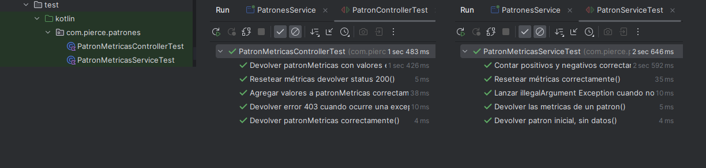

# Patrones-service

Este microservicio clasifica patrones de caracteres en positivos y negativos, almacena los totales acumulados en una base de datos, y expone una API REST para validar los patrones y obtener estadísticas de las verificaciones realizadas.

## Tecnologias y dependencias Utilizadas
- Kotlin con JDK 17
- SpringBoot
- Hibernate
- Maven
- MySQL
- Docker
- JUnit5 + Mockito
- Herramienta de prueba Postman

## Funcionalidad

### A - Validar Patrones de caracteres

Dado una lista de cadenas que representa patrones de caracteres, el microservicio evalua cada uno de los elementos de la lista, de acuerdo a las siguientes reglas

- "0RH+" se considera positivo
- "0RH-" se considera negativo

Cada validación actualiza las estadísticas almacenadas en la base de datos, incrementando el total de positivos o negativos según corresponda.
En caso de encontrarse alguno de estos, el servicio devuelve un HTTP 200 OK y en caso no haber ninguno presente, se manda un HTTP 403- FORBIDDEN.


### B - Obtener estadisticas acumuladas.

Este endpoint expone las estadísticas acumuladas de todas las operaciones realizadas por el servicio. Devuelve la cantidad total de patrones positivos y negativos.


## Testings unitarios tanto en el service como en el controller

Se realizaron pruebas unitarias para asegurar el correcto funcionamiento de estos componentes clave. Para ello, se utilizaron herramientas como JUnit y Mockito, que permiten simular los comportamientos de las dependencias y comprobar que cada componente interactúa de manera correcta y se comporta según lo esperado.




## Como correr el proyecto - Opción 1

1) Hay que tener Docker instalado y abierto.
2) En el directorio raiz del proyecto, a través de CMD lanzamos el comando para crear el contenedor
   ```bash
     docker-compose build
     ```

3) Luego montamos y lanzamos la imagen con el comando
     ```bash
         docker-compose up
     ```
     
4) Utilizamos la coleccion postman que se encuentra en el directorio raiz
5) ¡Listo para probar!


## Como correr el proyecto - Opción 2 (Sin docker)

1) Abrimos el Workbench ó XAMP para la base de datos.
2) Creamos la base de datos con el nombre "patrones-service"
3) Configuramos las variables de entorno de la IDE, en este caso usamos IntelliJ IDEA se hace de la siguiente forma


   Copiamos y pegamos lo siguiente

   ```bash
   spring.datasource.url=jdbc:mysql://localhost:3306/patrones-service?useSSL=false&serverTimezone=UTC
   spring.datasource.username=admin
   spring.datasource.password=admin
   ```

   

4) Corremos el proyecto con la IDE normalmente.
5) Utilizamos la coleccion postman que se encuentra en el directorio raiz
6) ¡Listo para probar! 
